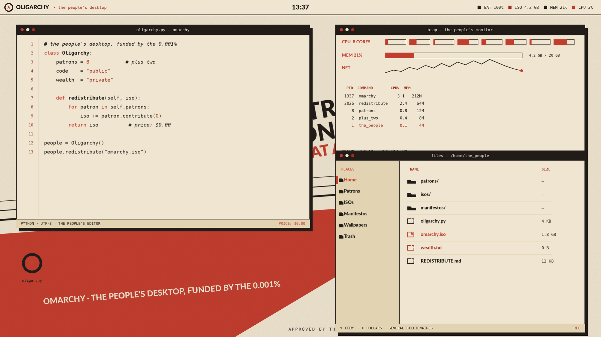
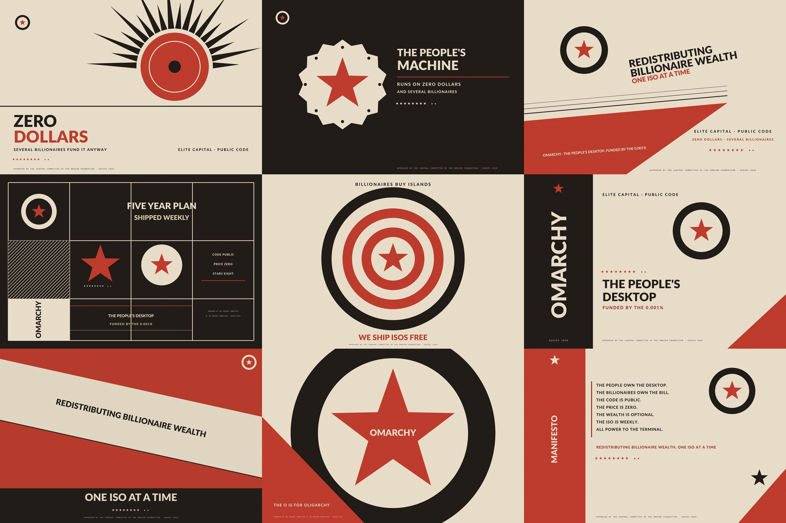

# Red Wedge

A light theme for [Omarchy](https://omarchy.org). Old print work guides the look. Each poster stays within aged paper, black ink, and party red.





Nine scenes shift the scale and balance. Wedges, stars, targets, grids, and bold type keep each frame distinct.

## Install

```bash
omarchy theme install https://github.com/joshuaswarren/omarchy-theme-red-wedge
```

## Palette

| Role | Hex |
| --- | --- |
| Background | `#efe5d0`. |
| Ink | `#211c18`. |
| Accent | `#c33d2e`. |
| Deep red | `#a02f22`. |
| Olive | `#6d7a4f`. |
| Mustard | `#c99a2e`. |
| Steel blue | `#46688c`. |
| Muted | `#8a8272`. |

See [`colors.toml`](colors.toml) for the full ANSI set. Icons use `Yaru-red`.
