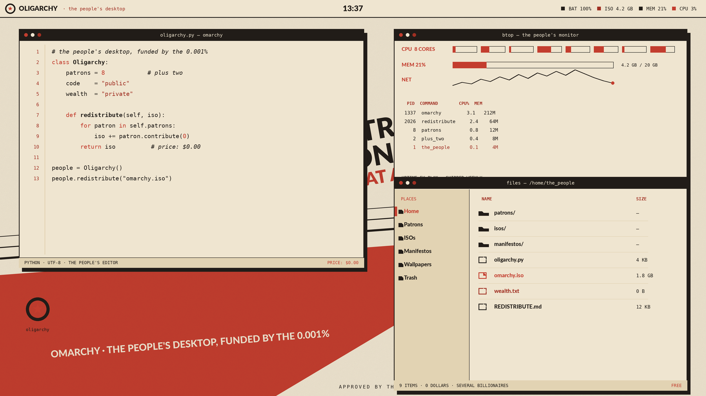
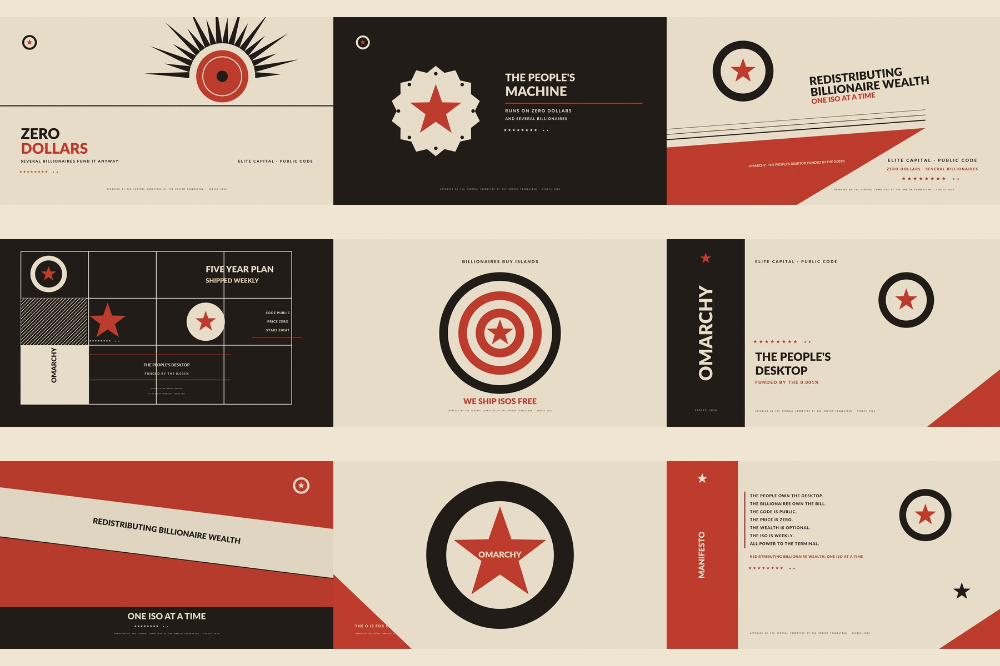

# Red Wedge

[](https://github.com/sponsors/joshuaswarren)

A light theme for [Omarchy](https://omarchy.org). Old print work guides the look. Each poster stays within aged paper, black ink, and party red.





Nine scenes shift the scale and balance. Wedges, stars, targets, grids, and bold type keep each frame distinct.

## Install

```bash
omarchy theme install https://github.com/joshuaswarren/omarchy-theme-red-wedge
```

## Palette

| Role | Hex |
| --- | --- |
| Background | `#efe5d0`. |
| Ink | `#211c18`. |
| Accent | `#c33d2e`. |
| Deep red | `#a02f22`. |
| Olive | `#6d7a4f`. |
| Mustard | `#c99a2e`. |
| Steel blue | `#46688c`. |
| Muted | `#8a8272`. |

See [`colors.toml`](colors.toml) for the full ANSI set. Icons use `Yaru-red`.

## Support

Every bit of support helps keep omarchy-theme-red-wedge alive and free. If you are able, [sponsor on GitHub](https://github.com/sponsors/joshuaswarren) or send a Lightning donation to `joshuaswarren@strike.me` to directly fund continued development and new integrations.

[](https://github.com/sponsors/joshuaswarren)

If financial support is not an option, you can still make a big difference: [star the repo](https://github.com/joshuaswarren/omarchy-theme-red-wedge), share it, or recommend it to a colleague. Word of mouth is how most people find omarchy-theme-red-wedge.
